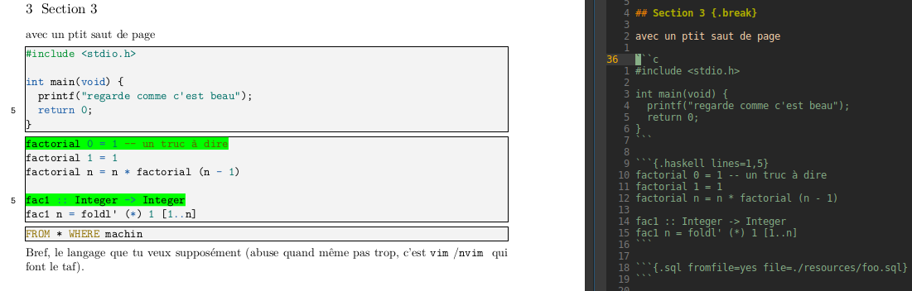
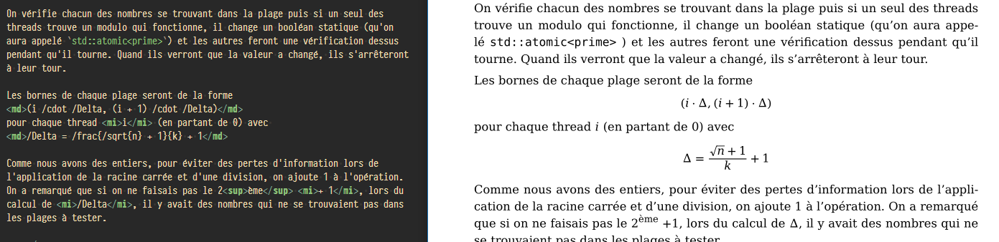

# ConTeXt environment suitable for computer science reports

The purpose of this tool is to ease compiling reports containing embedded code
and other markup elements usuan in computer science reports.
This repository contains [ConTeXt][ConTeXt] transformation rules from
[Pandoc][Pandoc] html using [ConTeXt] and is meant to be used as an overlay to
[pandoc-xhtml][pandoc-xhtml].

## Reference pipeline

Pandoc takes a list of markdown documents and compiles an (X)HTML representation
of them.
The XML result may be processed with [MkIV][MkIV] (ConTeXt's processing engine)
and transformed into valid [ConTeXt][ConTeXt] source.
This source can be used to produce PDF files and what not.

## Prerequisites

- `context`.
- `pandoc-plantuml` and `inkscape` (optional, for inline plantuml support).
- `pandoc`.
- `vim` (optional, for syntax highlighting).

## How to use this project

### Building a PDF from markdown sources

- Use pandoc to generate an XML file from your markdown sources:
  ```sh
  $ pandoc --no-highlight -s --section-divs -o document.xml -t html document.md
  ```

- Call context with `cs-report.tex` as the environment.
  ```sh
  $ context --environment=cs-report.tex document.xml
  ```

Optionally, you may use your own [ConTeXt][ConTeXt] environment, just make sure
to call `cs-report.tex` from it.
You may also define new transformation rules to generate more content (such as a
title page), see the project under `example/` for a full-features example.

```tex
% file: custom-environment.tex

\input ./3rd-party/cs-report.tex
```

It is recommended you use a build system, such as GNU `make` to manage the
generation of your project.

### Additional syntax provided by this environment

The following elements are not part of the markdown syntax supported by pandoc
but have been implemented by this environment.

- `toc` field in the _YAML medatada_. By setting the `toc` to `yes`, a table of
  contents will be generated.
  ```markdown
  ---
  toc: yes
  ---
  # Section 1
  ## ....
  ```

- Links as footnotes: Markdown link references will be rendered as footnotes.
  ```markdown
  This link reference[^1] will be rendered as a footnote[^2]

  [^1]: <https://spec.commonmark.org/0.29/#link-reference-definitions>
  [^2]: <https://en.wikipedia.org/wiki/Note_(typography)>
  ```

- Pagebreaks may be controlled by using the `{.nopagebreak}` or `{.break}`
  annotations on the sections.
  ```markdown
  ## A subsection {.break}

  Text

  # A main section {.nopagebreak}

  More text
  ```

- Inlined code will be syntax-highlighted if `vim` is installed.
  Mind that a folder named `vimout` must exist in the working directory, since
  as of now it cannot be created automatically, this should be fixed eventually.

- Code may be imported from file into the document.

- Inlined code may have highlighted lines.\
  

- Inlined and display mathematics using `/` instead of classical `\`.\
  

- Text alignment within columns.

You may want to check the `example/` project, which contains an additional
transformation to generate title pages from the YAML metadata of the file.

### Example project

An example project is provided in the `example/` directory.

This project is built automatically by the CI, you can access [the rendered
version here][ci-example].

[ConTeXt]: https://wiki.contextgarden.net/Main_Page
[ci-example]: https://gitlab.com/roosemberth/pandoc-markdown-context-template/-/jobs/artifacts/master/raw/artifacts/Example.pdf?job=Render%20example
[MkIV]: https://tex.stackexchange.com/a/448813
[Pandoc]: https://pandoc.org
[pandoc-xhtml]: https://github.com/ousia/from-pandoc-to-context
