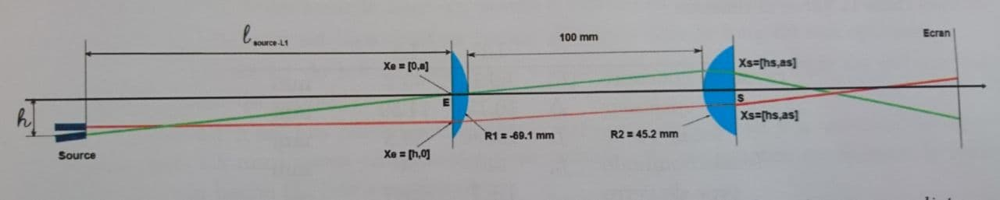
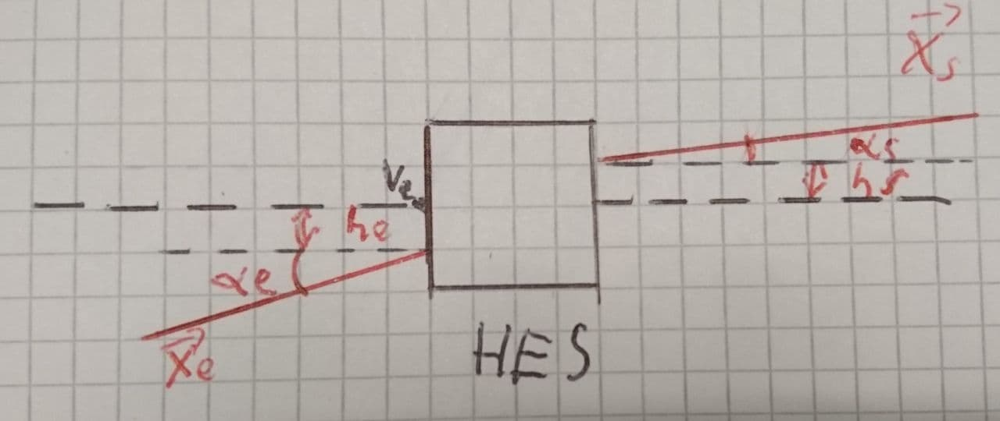
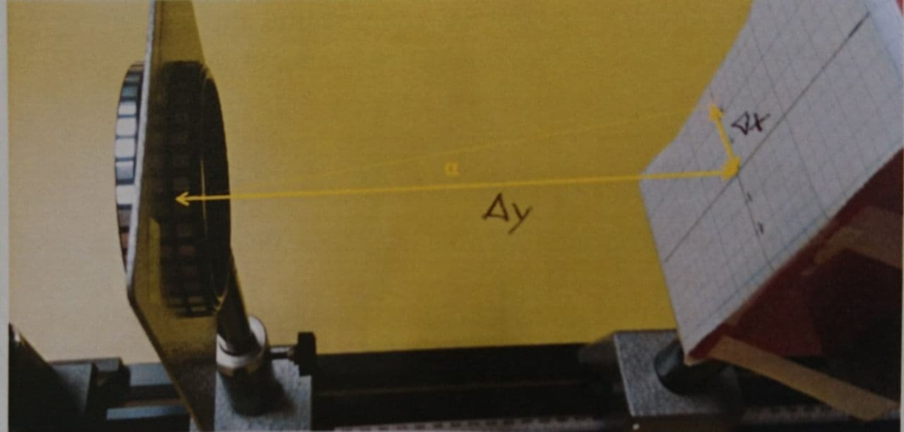

## Introduction {.nopagebreak}

Le but de cette expérience est de mesurer les coefficients de la matrice de transfert d'un système
optique composé de deux lentilles épaisses, le tout afin de comparer les coefficients théoriques préalablement
calculés avec les résultats de cette expérience.

## Développement théorique {.nopagebreak}

Tout système optique peut être représenté de manière matricielle par une matrice <mi>/mathcal{H}/subscript{ES}</mi>, ce qui permet de simplifier des systèmes complexes en cette seule matrice.
<md>
/startformula
  /startmatrix[align={right, right},left={/left[},right={/right]}]
      /NC h_{s}/NR
      /NC n_{s}/alpha_{s} /NR
    /stopmatrix
    =
    /startmatrix[align={right, right},left={/left[},right={/right]}]
      /NC h_{11} /NC h_{12} /NR
      /NC h_{21} /NC h_{22} /NR
    /stopmatrix
    /cdotp
    /startmatrix[align={right, right},left={/left[},right={/right]}]
      /NC h_{e} /NR
      /NC n_{e}/alpha_{e} /NR
    /stopmatrix
    /equiv
    X_{s} = /mathcal{H}/subscript{ES} /cdotp X_{e}
/stopformula
</md>

où <mi>X_{e}</mi> et <mi>X_{s}</mi> sont respectivement les vecteurs d'entrée et de sortie.
 

Le vecteur d'entrée
<md>
/startformula
  X_{e} =
  /startmatrix[align={right, right},left={/left[},right={/right]}]
    /NC h_{e} /NR
    /NC n_{e}/alpha_{e} /NR
  /stopmatrix
/stopformula
</md>
possède deux composantes. <mi>h_{e}</mi> représente l'écart entre le point d'entrée
et le vertex du dioptre; <mi>/alpha_{e}</mi> représente l'angle par rapport à l'horizontale
de ce même faisceau d'entrée; <mi>n_{e}</mi> représente l'indice de réfraction du milieu
initial. Il en va de façon analogue pour le vecteur de sortie <mi>X_{s}</mi>.

Il est possible de déterminer la matrice <mi>/mathcal{H}/subscript{ES}</mi> de deux manières différentes; la première
par les calculs théoriques, la deuxième par processus d'expérimentaton.

### Détermination par calculs

Notre système optique est constitué d'un système de deux lentilles épaisses séparées de <mi>100 mm</mi>. Une lentille épaisse peut être simplifiée en un sous-système optique de deux lentilles fine, et d'une matrice de transition. Cette dernière peut aussi être appliquée entre les deux lentilles épaisses de notre système.

Une matrice de réfraction (dioptre optique) peut s'écrire de la manière suivante:
<md>
  /startformula
    /mathcal{R} =
    /startmatrix[align={right, right},left={/left[},right={/right]}]
      /NC 1 /NC 0 /NR
      /NC -V /NC 1 /NR
    /stopmatrix
  /stopformula
</md>

 
 
 
 

Ici, <mi>V</mi> représente la vergence du dioptre. Elle se calcule comme suit:

<md>
  /startformula
    V /equiv /frac{n_{i}-n_{o}}{R}
  /stopformula
</md>

Ici:

- <mi>n_{o}</mi>: Indice de réfraction dans l'espace objet
- <mi>n_{i}</mi>: Indice de réfraction dans l'espace image
- <mi>R</mi>: Rayon de courbure du dioptre

Dans le cas particulier où le dioptre n'aurait pas de rayon de courbure et serait un
plan horizontal, il est admis que sa vergence est nulle (<mi>V = 0</mi>). De ce fait, sa
matrice de réfraction serait la matrice identité:

<md>
  /startformula
    /mathcal{I} =
    /startmatrix[align={right, right},left={/left[},right={/right]}]
      /NC 1 /NC 0 /NR
      /NC 0 /NC 1 /NR
    /stopmatrix
  /stopformula
</md>

### Matrice de translation

Une matrice de tranlation permet de calculer matriciellement la translation d'un rayon
lumineux entre deux dioptres, au sein d'un milieu possédant un indice de réfraction homogène et invariant, et
se calcule comme suit:

<md>
  /startformula
    /mathcal{R} =
    /startmatrix[align={right, right},left={/left[},right={/right]}]
      /NC 1 /NC /frac{/overbar{AB}}{n} /NR
      /NC 0 /NC 1 /NR
    /stopmatrix
  /stopformula
</md>

Ici:

- <mi>/overbar{AB}</mi>: Distance entre les deux dioptres
- <mi>n</mi>: Indice de réfraction du milieu

### Modélisation du système optique

Comme nous pouvons le voir sur le schéma, le rayon lumineux va commencer par entrer dans la première lentille épaisse.
Le premier dioptre parcouru étant un plan horizontal, sa matrice de réfraction est <mi>/mathcal{I}</mi>, suivie d'une
matrice de translation, puis d'une matrice de réfraction au dioptre courbé. L'espace de tranlation entre les deux lentilles
se traduit de nouveau par une matrice de translation, suivi de la deuxième lentille épaisse. Cette dernière est à l'inverse
simplifiable par un dioptre courbé, suivi d'une matrice de translation, puis d'un plan horizontal.

L'ensemble complet de ces matrices est calculé comme suit:

<md>
  /startformula
    /mathcal{H}/subscript{ES} = /mathcal{IT_{3}R_{2}T_{2}R_{1}T_{1}I} \ \ \ \ \ \ \ \ \ \ \ \ \ \ \ \ \ \ \ (1)
  /stopformula
</md>

 
 

Ici:

- T1:
<md>
  /startformula
    /mathcal{R} =
    /startmatrix[align={right, right},left={/left[},right={/right]}]
      /NC 1 /NC 0.0067 /NR
      /NC 0 /NC 1 /NR
    /stopmatrix
  /stopformula
</md>

- R1:
<md>
  /startformula
    /mathcal{R} =
    /startmatrix[align={right, right},left={/left[},right={/right]}]
      /NC 1 /NC 0 /NR
      /NC -7.4544 /NC 1 /NR
    /stopmatrix
  /stopformula
</md>

- T2:
<md>
  /startformula
    /mathcal{R} =
    /startmatrix[align={right, right},left={/left[},right={/right]}]
      /NC 1 /NC 0.1 /NR
      /NC 0 /NC 1 /NR
    /stopmatrix
  /stopformula
</md>

- R2:
<md>
  /startformula
    /mathcal{R} =
    /startmatrix[align={right, right},left={/left[},right={/right]}]
      /NC 1 /NC 0 /NR
      /NC -11.396 /NC 1 /NR
    /stopmatrix
  /stopformula
</md>

- T3:
<md>
  /startformula
    /mathcal{R} =
    /startmatrix[align={right, right},left={/left[},right={/right]}]
      /NC 1 /NC 0.0096 /NR
      /NC 0 /NC 1 /NR
    /stopmatrix
  /stopformula
</md>

Finalement, en se référant à l'équation matricielle (1), on obtient la matrice <mi>/mathcal{H}/subscript{ES}</mi> suivante:

<md>
  /startformula
    /mathcal{H}/subscript{ES} =
    /startmatrix[align={right, right},left={/left[},right={/right]}]
      /NC 0.1548 /NC 0.0997 /NR
      /NC -10.3554 /NC -0.2090 /NR
    /stopmatrix
  /stopformula
</md>

## Fond théorique de l'expérimentation

Sachant qu'on peut modéliser notre système optique au moyen de la matrice <mi>/mathcal{H}/subscript{ES}</mi> comme suit:

<md>
  /startformula
    /startmatrix[align={right, right},left={/left[},right={/right]}]
      /NC h_{s} /NR
      /NC n_{s} /cdotp /alpha_{s} /NR
    /stopmatrix
    =
    /startmatrix[align={right, right},left={/left[},right={/right]}]
      /NC h_{11} /NC h_{12} /NR
      /NC h_{21} /NC h_{22} /NR
    /stopmatrix
    /cdotp
    /startmatrix[align={right, right},left={/left[},right={/right]}]
      /NC h_{e} /NR
      /NC n_{e} /cdotp /alpha_{e} /NR
    /stopmatrix
  /stopformula
</md>

en mesurant le vecteur en sortie du système optique en influant sur son entrée, il devient possible de retrouver les coefficients
de la matrice <mi>/mathcal{H}/subscript{ES}</mi> . Pour ce faire, il faudra réaliser deux séries de mesures distinctes;
la première en figeant l'angle <mi>/alpha_{e}</mi> du vecteur d'entrée à 0, mais en faisant varier sa hauteur, on pourra déduire les
coefficients <mi>h_{11}</mi> et <mi>h_{21}</mi>. Quant aux coefficiants <mi>h_{12}</mi> et <mi>h_{22}</mi>, ils peuvent être obtenus en
figeant cette fois-ci <mi>h_{e}</mi> à 0 et en faisant varier <mi>/alpha_{e}</mi>.

Cet état de fait est dû aux simplifications suivantes de la modélisation matricielle du système optique suivantes:

<md>
  /alpha_{e} = 0 /rightarrow h_{s} = h_{11} /cdotp h_{e};\ \ \ /alpha_{s} = h_{21} /cdotp h_{e}
</md>
<md>
  h_{e} = 0 /rightarrow h_{s} = h_{12} /cdotp /alpha_{e};\ \ \ /alpha_{s} = h_{22} /cdotp /alpha_{e}
</md>

Ces équations prennent en compte le fait que <mi>n_{e}</mi> et <mi>n_{s}</mi> prennent tous les deux en compte l'indice de réfraction de
l'air, qui vaut 1.

L'angle en sortie <mi>/alpha_{s}</mi> est déterminé en mesurant l'écart entre le centre du pointeur laser et le centre de la cible
(<mi>/Delta_{x}</mi>), ainsi que la distance entre la cible et la deuxième lentille épaisse du système (<mi>/Delta_{y}</mi>).

<md>/alpha_{s} = /arctan{/frac{/Delta_{x}}{/Delta_{y}}}</md>

<!--- Insert image mesure angle -->

## Procédé expérimental {.nopagebreak}

1. Noter la position de l'axe optique (normalement à 100 mm sur l'axe transveral au rail);
1. Mesurer dans le plan de sortie S la distance de sortue du rayon par rapport à l'axe optique en collant l'écran contre la lentille de sortie;
1. Mesurer l'angle du rayon lumineux en éloignant l'écran le plus possible et en mesurant la distance à l'axe optique du spot ainsi que la distance entre la lentille et l'écran;
1. Déplacer le laser par pas de 4mm sur son support et refaire la mesure jusqu'à-ce-que le polariseur bloque le laser;
1. Replacer le laser à la hauteur de l'axe optique du système.

## Présentation des données brutes {.nopagebreak}

Pour <mi>/alpha_{s} = 0</mi>:

| **he** [m]            | **hs** [m] | **<mi>/Delta_{X}</mi>** [m] | **<mi>/Delta_{Y}</mi>** [m] | **<mi>/alpha_{S}</mi>** [rad]       |
|-------------------|--------|------------|------------|--------------------|
| 0                 | 0      | 0      | 0.26   | 0                  |
| 0.069813170079773 | 0.001  | -0.01  | 0.254  | -0.039349756388605 |
| 0.10471975511966  | 0.0015 | -0.01  | 0.177  | -0.056437178311703 |
| 0.139626340159546 | 0.0015 | -0.015 | 0.192  | -0.077966633831542 |
| 0.174532925199433 | 0.002  | -0.01  | 0.111  | -0.089847539694628 |
| 0.20943951023932  | 0.002  | -0.02  | 0.189  | -0.105427751122891 |
| 0.244346095279206 | 0.0025 | -0.02  | 0.151  | -0.131683853555638 |
| 0.279252680319093 | 0.0025 | -0.02  | 0.141  | -0.14090400627121  |
| 0.349065850398866 | 0.0025 | -0.02  | 0.112  | -0.176708856070037 |
| **Incertitudes abs.** |        |            |            |                    |
| 0.0005            | 0.0005 | 0.0005 | 0.0005 | 0.017453292519943  |

Pour <mi>h_{e} = 0</mi>:

| **<mi>/alpha_{E}</mi>** [rad]      | **hs** [m]  | **<mi>/Delta_{X}</mi>** [m] | **<mi>/Delta_{Y}</mi>** [m] | **<mi>/alpha_{S}</mi>** [rad]       |
|-------------------|---------|------------|------------|--------------------|
| 0                 | 0       | 0       | 0.012  | 0                  |
| 0.05235987755983  | -0.004  | -0.0075 | 0.58   | -0.012930313815177 |
| 0.087266462599717 | -7.5    | 0.001   | 0.852  | 0.001173708381224  |
| 0.10471975511966  | -0.0095 | -0.005  | 0.338  | -0.014791820507172 |
| 0.139626340159546 | -13.8   | -0.005  | 0.32   | -0.015623728620477 |
| 0.174532925199433 | -0.016  | -0.005  | 0.25   | -0.019997333973151 |
| 0.20943951023932  | -0.0195 | 0       | 0.273  | 0                  |
| 0.261799387799149 | -0.025  | 0       | 0.175  | 0                  |
| **Incertitudes abs.** |         |            |            |                    |
| 0.017453292519943 | 0.0005  | 0.0005  | 0.0005 | 0.017453292519943  |

Grâce à ces données, nous sommes à même d'effectuer la régression linéaire mentionnée précédemment afin d'établir la matrice
<mi>/mathcal{H}/subscript{ES}</mi> de façon expérimentale:

<md>
  /startformula
    /mathcal{H}/subscript{ES_{ex}} =
    /startmatrix[align={right, right},left={/left[},right={/right]}]
      /NC 0.0072 /NC 3.0360 /NR
      /NC -0.5018 /NC 0.0040 /NR
    /stopmatrix
  /stopformula
</md>

## Analyse des données finales {.nopagebreak}

Comme il est possible de le voir, la matrice <mi>/mathcal{H}/subscript{ES_{ex}}</mi> a des composantes qui sont passablement
éloignées de la matrice <mi>/mathcal{H}/subscript{ES}</mi> obtenue par calcul théorique. Cette différence peut notamment s'expliquer
par un modèle théorique qui approxime trop les déviations pratiques comme les éventuelles aberrations géométriques, et qui part du
principe que les lentilles sont parfaitement alignées. Ce n'est visiblement pas le cas au vu de la matrice <mi>/mathcal{H}/subscript{ES_{ex}}</mi>
obtenue, qui dévie de plus que sa marge d'incertitude de la matrice <mi>/mathcal{H}/subscript{ES}</mi>.

En effet, cet alignement est crucial puisque s'il n'est pas respecté, les angles incidents d'entrée dans les lentilles épaisses sont modifiés
à cause du mauvais alignement sur le banc expérimental. De ce fait, les offsets artificiels dûs à la disposition du système optique faussent les
mesures d'angle à l'entrée, respectivement la sortie de ces lentilles. De ce fait, il est plus que raisonnable de penser que les mesures obtenues
ne représentent pas la réalité et nous fournissent donc une matrice <mi>/mathcal{H}/subscript{ES_{ex}}</mi> imparfaite.

Les résultats pratiques obtenus nous révèlent donc que la calibration attentive du banc de test est plus que nécessaire à l'obtention de résultats
cohérents, mettant ainsi en lumière le bien-fondé du processus expérimental puisqu'il nous a montré l'alignement imparfait du système.

## Conclusion {.nopagebreak}

Notre manipulation en laboratoire vise à obtenir la matrice <mi>/mathcal{H}/subscript{ES}</mi> d'un système optique de deux lentilles
épaisses séparées de 100mm de manière théorique, puis expérimentale, afin de les confronter. Cette comparaison nous montre une différence
trop importante pour être expliquée seulement par les imprécisions de mesure. Cet écart s'explique par la grande imprécision de notre montage,
notamment à cause de la méthodologie et du matériel employé. Toutefois, cette expérience n'est pas un échec puisqu'elle a permis de mettre en
lumière l'importance cruciale de l'alignement d'un système optique tel que son objet.
